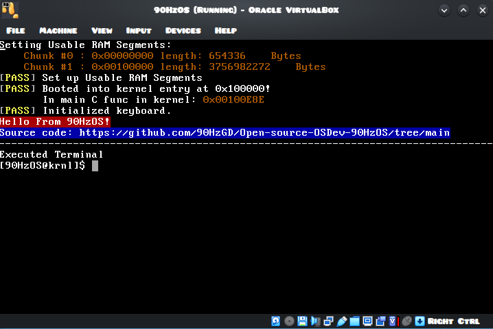
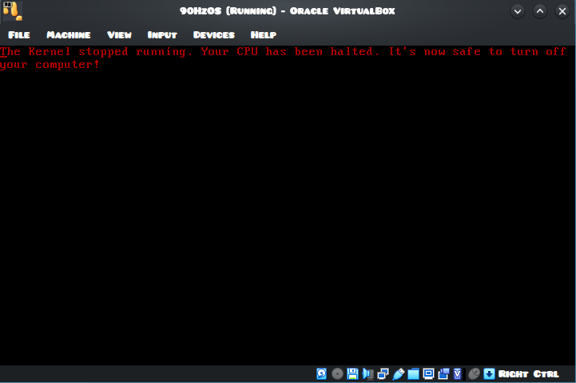

## Open Source OSDev Project made by a random GD French Player btw
This is the begining of my project _90HzOS_. (Sorry for bad english) This project **IS NOT PROFESSIONAL**

## GO TO
**Click Where you want to go!**
- [Here](#go-to)
    - [OS Screenshots](#os-screenshots)
    - [OS Features](#features)
        - [VGA Features](#vga-features)
        - [String Features](#string-features)
        - [Keyboard Features](#ps2-keyboard-features)
            - [Driver Features](#kb-driver)
            - [Keyboard API](#keyboard-driver-api)
    - [What does the compiled OS?](#what-does-the-compiled-os)
        - [Other](#other-functions)
    - [Compiling Tutorial (May need adaptations in Makefile)](#how-to-compile)
    - [How to run on QEMU](#how-to-run-on-qemu)
    - [How to run on VirtualBox](#how-to-run-on-virtualbox)

## OS Screenshots
- 
    - 90HzOS while running
- 
    - 90HzOS while shutted down via ^Q(Ctrl + Q)

## FEATURES
- This OS features, by now, only really basic things:
    - ## **VGA FEATURES**:
        - The OS is working in **VGA TEXT MODE** 80*25 grid (not that good but idcare for now), so here are **VGA TEXT MODE** function in my OS:
            - **print_string():**      prints a string with a given color and position to the screen thanks to the printchar() func
            - **print_char():**        prints a char to the screen with a given color and position
            - **clear_screen():**      clears the screen
            - **setBG():**             change the background color with a given color
            - **change_color():**      changes the color of the background of a given single position (& given color)
            - **move_grid():**         moves the **VGA TEXT MODE** grid.
            - **And the longest one: printf() which is divided by other functions:**
                - **printf():**             prints integers, unsigned integers, pointers, chars and strings inside of a given string with the sign: '%' in it, thanks to other functions
                - **print_integer():**      prints an integer to screen
                - **print_uinteger():**     prints an unsigned int to the screen
                - **print_hex():**          prints a hexadecimal RAM adress
    - ## **STRING FEATURES**:
        - Some basic **strings functions**:
            - **reverse_string():**     reverses the bytes position in string _(if input = {'a', 'b', 'c'}, then output = {'c', 'b', 'a'}_.
            - **replace_string():**     copies the content of a given input to another, ouputs in a given 2nd input
            - **length():**             outputs the length of a given string
            - **compare_string():**     outputs 1 if all elements of two given strings are the same, otherwise: outputs 0
    - ## **PS2 KEYBOARD FEATURES**
        - ## **KB DRIVER**
            - Some Low level keyboard driver functions:
                - **init_idt():**             initialize the **Interrupt Descriptor table** _(idt)_ and calls load_idt()
                - **load_idt():**             loads the idt with lidt instruction
                - **kbinit():**               outbyte at 0x21: 0b11111101 (activates only keyboard)
                - **enable_int():**           enables CPU interrupts (only keyboard for now)
                - **keyboard_handler():**     set in idt, manage each input on the keyboard (such as pressed / released, toogles Shift on or off, same for Ctrl and Alt btw)
                - **handle_keyboard():**      in kernel.c, manage the output of the keyboard, if 0x64 returns 1, the kernel talk to 0x60 to get the scancode, manages extended keys too.
        - ## **KEYBOARD DRIVER API**
            - Some functions to easily access to the keyboard activity via this **API**:
                - **get_key():**           outputs scancode _(does not wait for you to press smt, returns 0 if None keys are pressed)_
                - **init_keys():**         initializes the API array's
                - **transkey():**          takes a scancode as input and returns a struct of almost everything _(can manage Ctrl keybinds up to 6 appended inputs)_ _(Shift ON/OFF; Ctrl ON/OFF; Alt ON/OFF; ifchar; released; keypressed)_
                - **Shitkey():**           Used by transkey, returns the input as shifted on the keyboard _(examples: q -> Q; 1 -> !...)_ _(Shift ON/OFF formula: Shift Pressed XOR CapsLock)_
                - **extended_char():**     Also used by transkey, returns input if the key toogled is extended
    - ## **OTHER FUNCTIONS**:
        - **init_RAM():** describes in a struct, where the OS can write into RAM in several segments, associated with the length for each segment _(kernel.c func btw)_

- ## **WHAT DOES THE COMPILED OS**:
    - First the bootloader loads up at _0x7C00_ and loads **20 sectors** _(kernel entry + kernel)_ at 0x10000, which is moved to 0x100000 when switched to **32bit protected mode.**, it also get info about _Usable RAM segments at 0x8000_
    - Then, it jumps at **0x100000** and execute the kernel entry point, who calls the **main func** in _kernel.c_, the kernel initialize the **struct for usable memory segments**, and _initializes keyboard_.
    - Once all these steps done, it prints a welcome message and execute a hardcoded entry point for a program, here, its a _pseudo-terminal_ where the **only working command** is: "_clear_".
    - Once the terminal stopped, the main function returns and back to the **entry point file** _(entry.asm)_ it **halts the CPU until you shutdown the PC yourself**.

## How To compile
**PLZ NOTE THAT SOME COMMANDS WONT WORK ON WINDOWS, SO I RECOMMEND USING A UNIX/GNULinux SYSTEM**
- 1. First you will need an emulator like qemu to run the 'OS' and an assembler:
- **On Arch Linux** (btw)
- Run these two commands below:
    - ``sudo pacman -Suy  # update packages & packages list``
    - ``sudo pacman -S nasm qemu-common``
- **On Ubuntu or any Debian based Linux Distro**
    - ``sudo apt update && sudo apt full-upgrade -y``
    - ``sudo apt intall nasm qemu-common``
- **On Windows**
- Download the following files (you can also use curl with the link in PS):
  - ``https://www.nasm.us/pub/nasm/releasebuilds/3.02rc7/win64/nasm-3.02rc7-installer-x64.exe``
  - ``https://qemu.weilnetz.de/w64/2026/qemu-w64-setup-20260422.exe``

- 2. Then create an **OSDev** folder in your **HOME DIRECTORY**
- 3. Move all the content you downloaded from this repo into *~/OSDev*
- 4. Then you will need a cross-compiler and a linker:
    - Install gnu binutils:
         - ``mkdir /tmp/src``
         - ``cd /tmp/src``
         - ``curl -O https://ftp.gnu.org/gnu/binutils/binutils-with-gold-2.46.tar.xz``
         - ``tar xfv binutils-with-gold-2.46.tar.xz``
         - ``mkdir binutils-build``
         - ``cd binutils-build``
         - ``../binutils-with-gold-2.46.tar.xz/configure --target=i386-elf --enable-multilib --disable-nls --disable-werror --prefix=/usr/var/i386elfgcc 2>&1 | tee configure.log``
         - ``sudo make all install 2>&1 | tee make.log``
    - Install gcc cross compiler:
         - ``cd /tmp/src``
         - ``curl -O https://ftp.gnu.org/gnu/gcc/gcc-15.2.0/gcc-15.2.0.tar.xz``
         - ``tar xfv gcc-15.2.0.tar.xz``
         - ``mkdir gcc-build``
         - ``cd gcc-build``
         - ``../gcc-15.2.0/configure --target=i386-elf --prefix=/usr/var/i386elfgcc --disable-nls --disable-libssp --enable-language=c++ --without-headers``
         - ``sudo make all-gcc -j$(nproc)``
         - ``sudo make all-target-libgcc -j$(nproc)``
         - ``sudo make install-gcc -j$(nproc)``
         - ``sudo make install-taget-libgcc -j$(nproc)``
- 5. Add cross compilers to the **PATH**:
    - On **UNIX/GNULinux**:
        - **TEMP**:
            - To add the compilers to the PATH **temporarily** *(disapeare after closing bash session)*:
                - ``export PATH="/usr/var/i386elfgcc:$PATH"``
            - To add it **permanantly**, you can edit your ~/.bashrc file:
                - ``nano ~/.bashrc``
                - Add this line at the end if file:
                    - ``export PATH="/usr/var/i386elfgcc:$PATH"``
    - On **Windows NT**:
        - Search for: *Edit environment variables*
        - Click on _edit environment variables_
        - Click on **PATH**
        - Then click  _edit_
        - Then add the PATH to your cross compilers directory at the end
        - Then apply changes and _reboot your computer_
- 6. **END**
    - If you did the previous steps correctly (sorry if didn't work) you can do: ``cd ~/OSDev`` then execute: ``make all``
    - If you are on Windows, try to adapt the code of the Makefile!
    
## HOW TO RUN ON QEMU
- **RUN THIS COMMAND**:
    - ``qemu-system-x86_64 -monitor stdio -hda ~/OSDev/90HzOS/OS/90HzOS.bin``
## HOW TO RUN ON VIRTUALBOX:
- **FLOPPY DISK USAGE**
    - Create a new virtual machine and set img/disk.img as floppy disk drive
     
     
     
     
     
   
